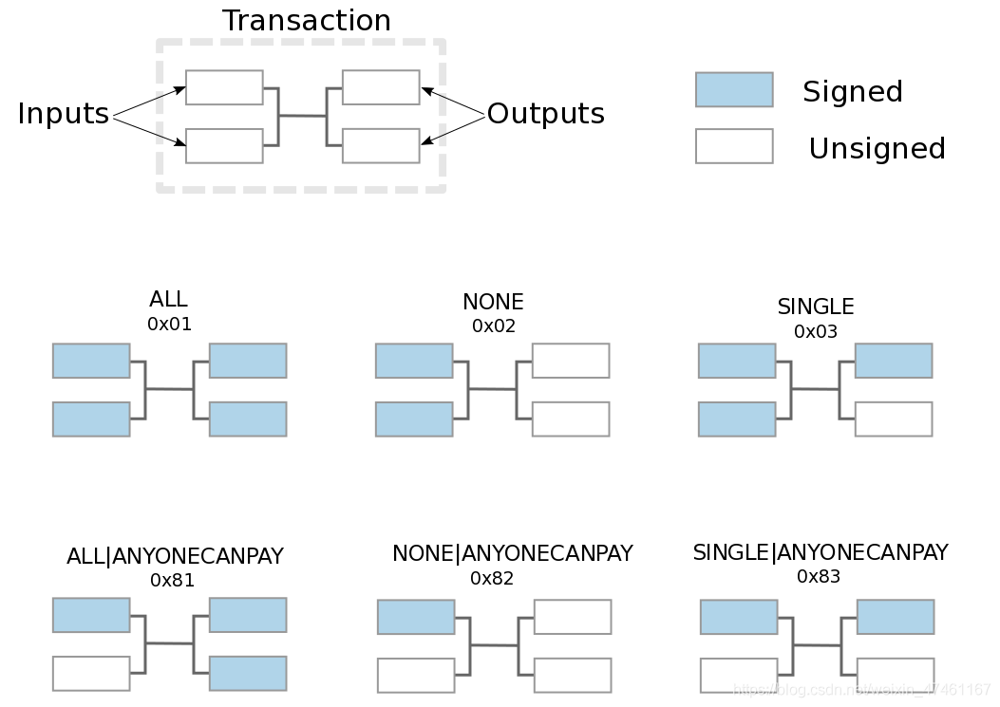

sCrypt是比特币合约走出来的第一步。我们看看sCrypt最被人期待的第一层Token

所谓第一层，就是比特币机制直接支持的Token。比特币脚本直接保证Token的增加减少分发转移符合规则，不需要其他的“二层网络“，“链下共识“等等画蛇添足技术。

一笔比特币交易的构成，如下图所示
|输入  | 输出 |
|--|--|
| 输入1，Outpoint1， 解锁脚本1  | 输出1，新锁定脚本1(接收方1)，Satoshi  |
| 输入2，Outpoint2， 解锁脚本2 | 输出2，新锁定脚本 2(接收方2)，Satoshi |
| 输入3，Outpoint3， 解锁脚本3  | 输出3，新锁定脚本 3 (找零)，Satoshi|
| 输入4，Outpoint4， 解锁脚本4  |  |
| 输入5，Outpoint5， 解锁脚本5  |  |

输入的数量可以是1到n个，输出也是1到n个。

其中Outpoint包含txid, ouputIndex， 可以获取原锁定脚本和包含的比特币Satoshi数量.

通过outpoint获取的锁定脚本可能一样也可能不一样，对应的解锁脚本也就不同。输出的新锁定脚本每一条大都是不一样的。

当原锁定脚本是P2PKH类型
```OP_DUP OP_HASH160 $pubKeyHash OP_EQUALVERIFY OP_CHECKSIG```，那么解锁脚本是签名和公钥```sig pk```
脚本匹配正确就可以使用输入中的Satoshi。所有输入包含的比特币Satoshi的合计减去所有输出的比特币Satoshi合计的差值就是矿工手续费，也叫交易手续费。

P2PKH脚本中只有代码，没有数据，它就是比特币脚本的```Hello World```，它解锁的只有Satoshi

而第一层Token的锁定脚本不仅仅有代码还有数据。


代码部分需要保证一笔一笔的交易对数据的处理符合程序逻辑。它解锁了更广阔的天地。

比如数据区域包含了一只猫（一幅画）

代码部分就要保证这只猫在每次交易中不被分割，不会丢失。这种Token合约叫做
NFT(NonFungibleToken)

合约代码的例子参见：[nonFungibleToken.scrypt](https://github.com/scrypt-sv/boilerplate/blob/master/contracts/nonFungibleToken.scrypt)。使用前两篇文章[原像PreImage](https://blog.csdn.net/weixin_47461167/article/details/108409290)和[OP_PUSH_TX](https://blog.csdn.net/weixin_47461167/article/details/108421502)介绍的技术很容易理解。

还有一种可分割的Token，比如数据区域包含了8张迪斯尼的门票，那么代码部分就要保证交易过程中一直是8张门票，不会凭空多出来，也不会凭空消失。


通过不断的交易，门票可能多次易主，有的人可能有3张门票，有的人可能一张也没有，全卖给了别人。这种Token合约要更复杂一些。

sCrypt官方提供多个[可分割Token的例子](https://github.com/scrypt-sv/boilerplate/tree/master/contracts)。使用前两篇文章[原像PreImage](https://blog.csdn.net/weixin_47461167/article/details/108409290)和[OP_PUSH_TX](https://blog.csdn.net/weixin_47461167/article/details/108421502)介绍的技术很容易理解。

需要继续解释的就是preimage。在原像preimage中包含两个重要的项目，第2项hashPrevouts和第8项hashOutputs，这两项根据第10项签名的类型的有所变化。在[官方例子](https://github.com/scrypt-sv/boilerplate/blob/master/contracts/advancedCounter.scrypt)中出现了ANYONECANPAY类型。



根据上图可以看到 ANYONECANPAY 所指的意思是原像只包含当前的输入和所有的输出。具体到代码实现上不关心第2项hashPrevouts，只需要正确设置当前输入相关的4，5，6，7以及第8项所有的输出hashOutputs。在锁定脚本的代码部分检查了所有输出的hashOutputs是否符合逻辑。也就是迪斯尼门票的分割合并是否正确。

有了对输入和输出的检查手段，Token无论可分割还是不可分割，都可以在比特币脚本中作出保证。这就是第一层Token的意思。

对于一名比特币用户来说，他打开钱包可以看到自己的

> 比特币数量  10 BSV
> 一只猫 
> 两张迪斯尼门票

他可以将猫卖给别人，他可以去迪斯尼花掉一张门票。他可以从其他人那里买一幅蒙娜丽莎和三张去东京的飞机票。他的钱包就变成了

> 比特币数量  1.998 BSV (在交易时花了钱和一点手续费)
> 一张迪斯尼门票
> 一副蒙娜丽莎
> 三张飞机票

他把蒙娜丽莎租赁出去，每天获得租赁费 100,000 Satoshi。一个月后，他的钱包就变成了

> 比特币数量  2.298 BSV (每天增加 100,000 Satoshi * 30)
> 一张迪斯尼门票
> 出租蒙娜丽莎的凭证
> 三张飞机票

交易就是Token的买卖，租赁就是去中心化金融(DeFi)

官方例子并不能直接拿来给普通用户使用，sCrypt是一种可以更容易滴实现Token的技术，这种技术从比特币12年前诞生就存在，而不被发现。

我们说打开sCrypt的盒子，不如说sCrypt打开了比特币的盒子。

你想要这个打开比特币盒子的钱包吗？敬请期待......


> 享受比特币带来的安全自由， 关注使用[NoteSV](https://note.sv)
