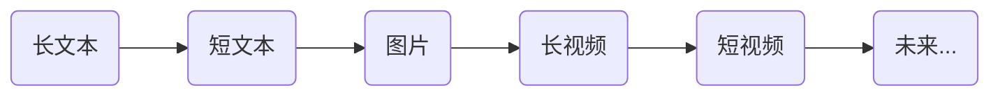

---

title: 用Vuepress Blog创建博客
summary: 各种坑，冒然踩了一下
date: 2020-11-02 22:30
tags:
- 博客
- vuepress

---

# 用Vuepress Blog创建博客
<ClientOnly>
  <CallAdsense />
</ClientOnly>

踩了一个大坑啊! 利用周末创建了一下Github Page，将个人域名 lilong.net 激活了。

博客是非常古老的，2000年代流行，我原来使用谷歌收购的 blogger.com 位置是 [Baryon Tracking](http://baryonlee.blogspot.com/)， 另外在[CSDN](https://blog.csdn.net/baryon)和[博客园](https://www.cnblogs.com/baryon)都有过博客。上去看一下，都不记得写过那些内容了。

博客后来进化成微博，朋友圈，视频网站，短视频。看上去的流行趋势是





只是博客来说，已经不太流行，甚至当年流行的聚合格式feed rss.xml都已经没人用了。谷歌当年就停止了[Reader服务](https://www.google.com/reader/about/)


最近要整理一些学习笔记，[比特币协会在CSDN有技术博客](https://bsv.csdn.net/)，我在里面[写了一些东西](https://blog.csdn.net/weixin_47461167)，需要一个地方整理，所以开通Github Page。


之前使用Gulp工具生成博客网页，这次重建发现了[GitHub - vuepress/vuepress-theme-blog: Default blog theme for VuePress.](https://github.com/vuepress/vuepress-theme-blog)

确实是好东西，但实际操作起来，好多坑。也可以说是这个系统的bug

<ClientOnly>
  <CallArticleAdsense />
</ClientOnly>

- [x] 博客内代码的高亮显示错误地显示了 大于等于号（ >= ）和不等号 ( != ) 
  
  解决办法：更换了code的style，拷贝自：[GitHub - xugaoyi/vuepress-theme-vdoing: 🚀一款简洁高效的VuePress 知识管理&amp;博客(blog) 主题](https://github.com/xugaoyi/vuepress-theme-vdoing)

- [x] 博客链接的日期显示 NaN/NaN/NaN 
  
  解决办法：每一篇博客内部一定要在前面包括 date，类似 `date: 2020-11-02 22:30` 只是博客文件名中包含日期是不行的。

- [x] 插入的图片不显示
  
  图片一定要从当前目录的点开始， 比如 `./images/bsv-dragon.png`没有点是不对的。vue使用loader会对图片正确处理。
 
  

- [ ] vuepress blog还有好几个坑，你信吗？不行就看源码吧

- [x] 博客的发布使用了Github的Action Workflow，在workflows里建yml

- [x] 绑定域名一定要创建CNAME文件，否则每次发布域名都被取消, 看deploy.sh

- [x] 开通vuess评论功能，要检查域名设置，要先创建issue，才能发布留言

- [x] 创建github账号同名的repo，可以美化Github的Profile页面

- [x] 为博客添加Adsense
  只需要在`.vuepress/config.js`里head部分追加下面的代码。然后在adsense网站，选择自动显示广告
  ```javscript
    [
      "script",
      {
        "data-ad-client": "ca-pub-2028497727822047",
        async: true,
        src: "https://pagead2.googlesyndication.com/pagead/js/adsbygoogle.js"
      }
    ]
  ```
