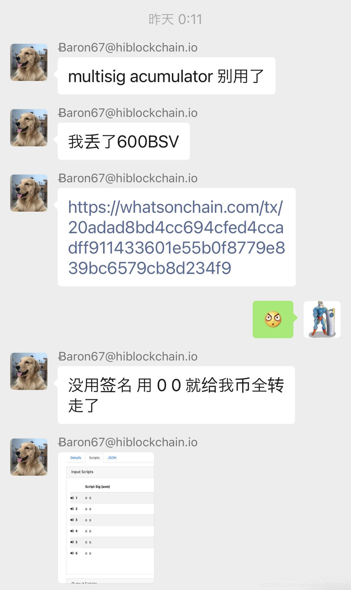
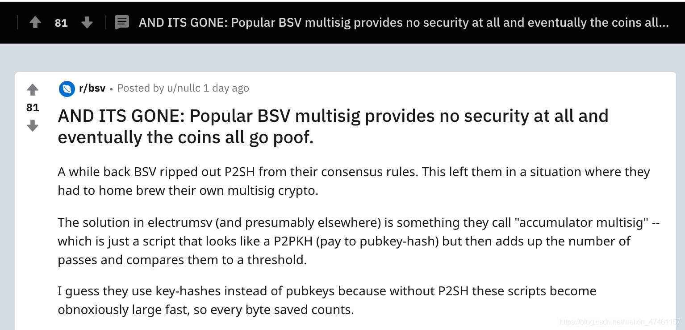
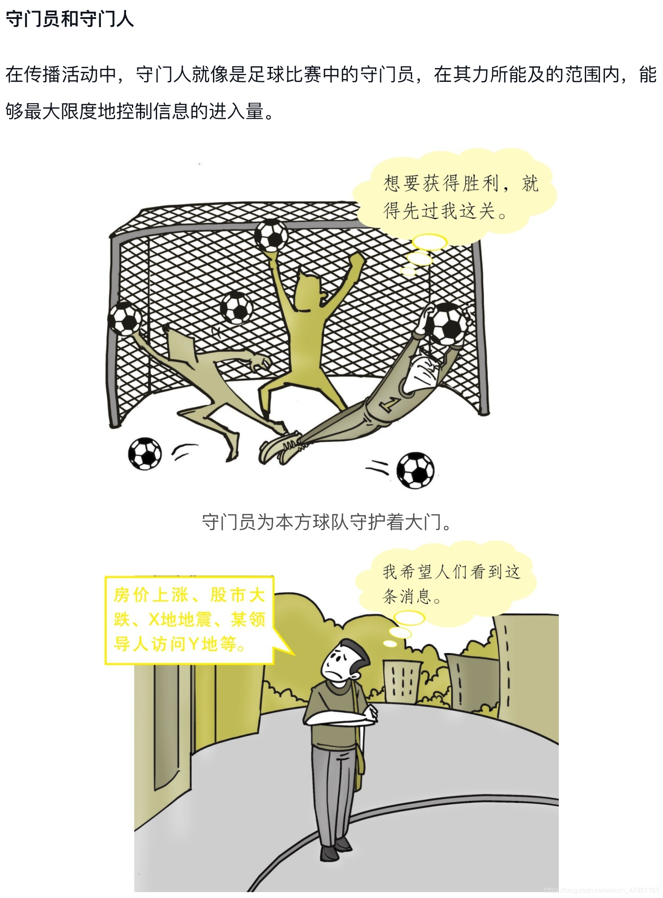
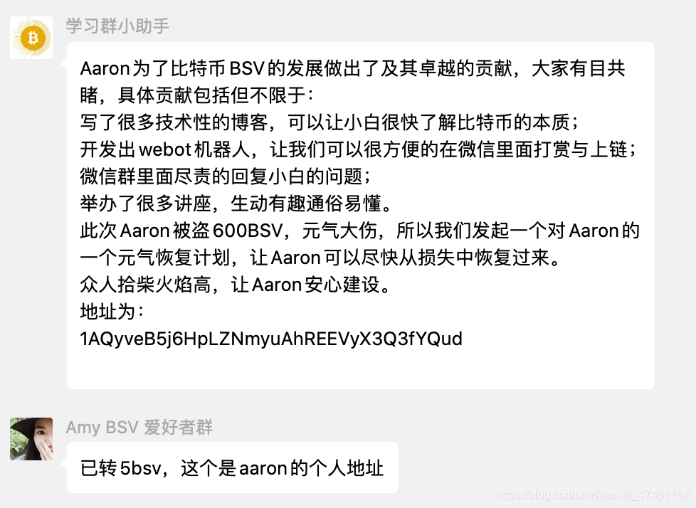
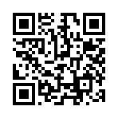

上个周末不平凡。瞧.拜登当上了美国总统。本打算看看新闻就睡了，但另一件大事让我一下子清醒了。

**BSV丟币了！整整600个！**

这个币丟的不平凡，丟的太牛逼。因为是从比特币脚本合约中被盗的。

以前只听说过以太坊智能合约丟币。最有名的就是 2017年以太坊Parity的多重签名钱包出现问题，93万个以太坊被锁，造成用户近1.5亿美金的损失。Parity钱包就是现在大大有名的波卡团队做的，他们当时还是eth钱包团队。那次丟的币里面也包括波卡ICO得到的30万个ETH。没有了这30万个，波卡脸皮厚，又ICO了一次，几年后的今天主网终于上线，正准备卖“平行宇宙”。以太坊上丟币的现象层出不穷，我都懒的翻历史了。

[深扒Parity钱包漏洞始末！1.5亿美金的最贵教训](https://mp.weixin.qq.com/s/7Hb6WeryBUgEDbLH-lkndA)

比特币上从没出现过这种丟法。因为之前的BTC没有脚本合约功能。今年2月BSV创世升级，脚本恢复，比特币合约才重回世界。

非常不幸，同ETH类似，这次BSV钱包Electrum SV也是在多签脚本合约上出了漏洞，被黑客高手抓住机会，拿走了600BSV。

BSV丢币的事，今早开始传开，失主BSV大神aaron67写下了全过程。[我被盗了 600 BSV](https://aaron67.cc/2020/11/08/lost-600-bsv/)

我现在写的这篇文章题目非常欠骂，丢币了，怎么还好！是我的错，就想博一下您的眼球。

因为这件事伴随而来的就是嘲讽，特别是拥护BTC/BCH的几个人更是兴奋。

翻出没丢币之前的某天截图，早起第一件事就是骂BSV

面对别人的损失，为什么有人兴奋呢？BSVer的正能量为什么这么弱呢？面对这个问题最近一直思考，今天找了传播学的书，翻了两章，看到了答案：守门人理论

比特币是门多学科的技术，今天才知道，除了计算机科学和自由经济学还包括传播学。

一些人不遗余力做守门员，不让你知道 比特币也有脚本，也有合约，而且TPS3000，收费低到可以忽略。

目前知道这些“秘密”的只是一些不善言辞的程序员，让我来揭示这个秘密，关于比特币合约的技术知识可以参考下面的Wiki：[https://wiki.bsv.info/scrypt](https://wiki.bsv.info/scrypt)

注意其中的一些看似难懂的纯技术文章，未来几个月都将变成让你耳目一新的切身体验。

最后，BSV社区在捐助aaron67大神，扫码，然后同微信截图里的地址比较，别转错了。谢谢。

众人拾柴火焰高，让Aaron安心建设。
地址为：`1AQyveB5j6HpLZNmyuAhREEVyX3Q3fYQud`

> 谢谢大家为更好的比特币做出的贡献
> 享受比特币带来的安全自由， 关注使用[NoteSV](https://note.sv)