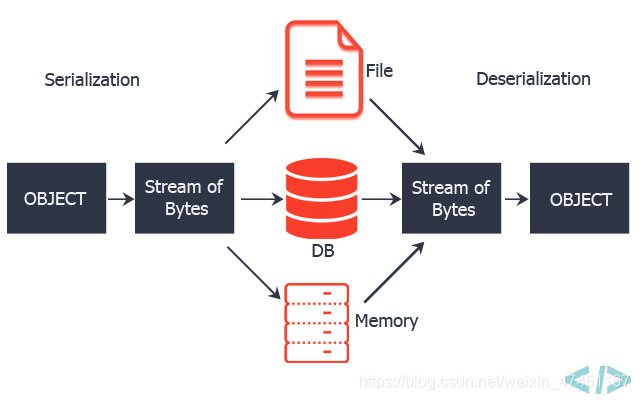

---

title: 打开sCrypt的盒子（6）数据序列化
summary: 数据序列化，就是将一个数据结构或者对象，按照某种规则组合成一个输出，可以是字节数组，也可以是一个格式文件或者字符串。序列化的目的是为了对象的网络传输，数据存储。
date: 2020-10-19 11:53:40
lang: zh
tags: 
  - 比特币
  - sCrypt
  
---
数据序列化，就是将一个数据结构或者对象，按照某种规则组合成一个输出，可以是字节数组，也可以是一个格式文件或者字符串。序列化的目的是为了对象的网络传输，数据存储。

序列化后数据还可以反序列化形成对象。


举个例子，表示状态的对象

```javascript
let state = {'counter': 11, 'bytes': '1234', 'flag': true}
```

如果序列化成JSON[https://www.json.org/](https://www.json.org/)格式则为：

```json
{
"counter":11,
"bytes":"1234",
"flag":true
}
```

如果序列化成msgpack[https://msgpack.org/](https://msgpack.org/)

```hex
83 A7 63 6F 75 6E 74 65 72 0B A5 62 79 74 65 73 A4 31 32 33 34 A4 66 6C 61 67 C3
```

如果序列化为YAML[https://yaml.org/](https://yaml.org/)

```yaml
---
counter: 11
bytes: '1234'
flag: true
```

无论是JSON还是msgpack，yaml都有程序库可以反序列化数据为对象。

在比特币脚本中如何做这种序列化呢？从比特币脚本操作符[https://wiki.bsv.info/op-codes](https://wiki.bsv.info/op-codes)知道下面几个命令

| 符号           | 值 (十六进制)  | 输入        | 输出   | 描述                             |
|:------------ |:--------- |:--------- |:---- |:------------------------------ |
| 1-75         | ```0x01-0x4b```| (special) | data | 把接下来的N 个字节压入堆栈中，N 的取值在1 到75 之间 |
| OP_PUSHDATA1 | ```0x4c```| (special) | data | 下一个字节包括数字N，会将接下来的N 个字节压入堆栈     |
| OP_PUSHDATA2 | ```0x4d```| (special) | data | 下面两个字节包括数字N，会将接下来的N 个字节压入堆栈    |
| OP_PUSHDATA4 | ```0x4e ```| (special) | data | 下面四个字节包括数字N，会将接下来的N 个字节压入堆栈    |

sCrypt最新版[https://github.com/scrypt-sv/scryptlib](https://github.com/scrypt-sv/scryptlib)中使用上面的命令做了一个序列化的初步实现。

先看一下下面的代码片段

```plain
OP_RETURN 0b 1234 01 0700
```

这就是上面state对象的序列化结果。按照顺序

```'counter': 11```对应对应```0b```

```'bytes': '1234'```对应```1234```

```'flag': true```对应```01```

注意这里都是hex，而不是整数。

上面代码片断在脚本HEX的表现是

```plain
6a010b0212340101020700
```

我们分割一下，解释

```plain
6a 010b 021234 0101 020700
```

```6a```是```OP_RETURN```
```010b```的```01```是表示后面有一个字节的数据，数据是```0b```

```021234```的```02```是表示后面有两个字节的数据，数据是```1234```

```0101```的```01```是表示后面有一个字节的数据，数据是```01```

```020700```的```02```是表示后面有两个字节的数据，数据是```0700```

```0700```是little endian的数据```7```，表示前面有多少个字节的数据，```010b 021234 0101```合计刚好是7个字节。

可以看出来这个序列化的方式是

* 整体格式```OP_RETURN + 数据 + 数据长度```
* 每个数据片断是脚本操作符1-75或者OP_PUSHDATAx + 数据值
* 数据片断不包含名称'counter','flag'，只有数据值

序列化的原理就这么多，关键是要理解脚本是如何压数据入栈的。

合约代码和测试代码见GitHub:

[https://github.com/scrypt-sv/boilerplate/blob/master/contracts/stateSerializer.scrypt](https://github.com/scrypt-sv/boilerplate/blob/master/contracts/stateSerializer.scrypt)

**注意：在这篇文章写作期间，"scryptlib":"^0.2.10"还不支持超过75个字节的字节数组入栈。
另外：Varint和OP_PUSHDATA是不同的，不可混淆。**

因为这种序列化之后不包括key，所以顺序就变得非常重要。否则反序列化的时候就不正确了。
这篇文章写的很好： [http://jartto.wang/2016/10/25/does-js-guarantee-object-property-order/](http://jartto.wang/2016/10/25/does-js-guarantee-object-property-order/)
下面的对象，序列化顺序的规律你能掌握吗？
```bash
> data = {'1':'aaa','2':'bbb','3':'ccc','测试':'000'}
{ '1': 'aaa', '2': 'bbb', '3': 'ccc', '测试': '000' }
> data = {'测试':'000','1':'aaa','2':'bbb','3':'ccc'}
{ '1': 'aaa', '2': 'bbb', '3': 'ccc', '测试': '000' }
> data = {'a':'000','1':'aaa','2':'bbb','3':'ccc'}
{ '1': 'aaa', '2': 'bbb', '3': 'ccc', a: '000' }
```

感兴趣的人看一看更深入的讨论 [https://stackoverflow.com/questions/5525795/does-javascript-guarantee-object-property-order](https://stackoverflow.com/questions/5525795/does-javascript-guarantee-object-property-order)

直接说结论，序列化的对象要保证没有数字作为key，比如不要有 ```'1':'aaa'```
这样序列化key的顺序就是定义顺序，先写出来的在前面，后写出来的在后面。

---
（后记）

既然知道初步实现的序列化有一些问题，那么就贡献自己的代码好了。
去Fork一个[sCryptLib](https://github.com/scrypt-sv/scryptlib)的代码，先写[BDD驱动](https://zh.javascript.info/testing-mocha)的测试代码，然后再做具体实现。

我们希望下面一些用法，把想法都写在BDD测试代码里

 - 不只是对象，也支持数组的序列化
 - 支持反序列化，反序列化的时候可以识别出类型
 - 支持BigInt
 - 支持比特币脚本数字 OP_0 OP_1 OP_1NEGATE OP_2 ... ... OP_16
 - Bool类型使用OP_TRUE和OP_FALSE
 - 支持OP_Pushdata1,2,4，也就是支持大内容

写好的测试代码参考
 [https://github.com/scrypt-sv/scryptlib/blob/master/test/serializer.test.ts](https://github.com/scrypt-sv/scryptlib/blob/master/test/serializer.test.ts)

然后编写代码，让代码通过测试。3天期间做了多次修改，修改了两个库，完美实现，提交给官方，获得review，再次修改，最终代码合并。新的序列化使用方法请参考测试代码。

同时对合约代码也做了修改
[https://github.com/scrypt-sv/boilerplate/blob/master/contracts/serializer.scrypt](https://github.com/scrypt-sv/boilerplate/blob/master/contracts/serializer.scrypt)

> 谢谢大家为更好的比特币做出的贡献
> 享受比特币带来的安全自由， 关注使用[NoteSV](https://note.sv)